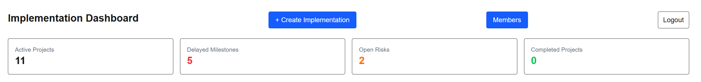
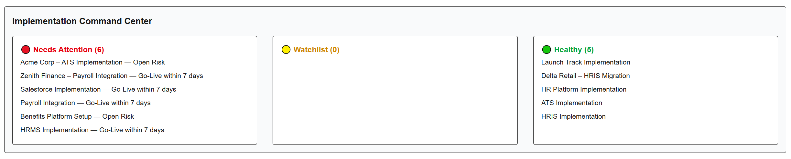
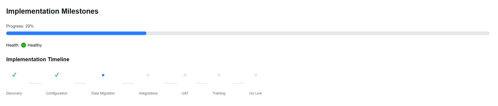
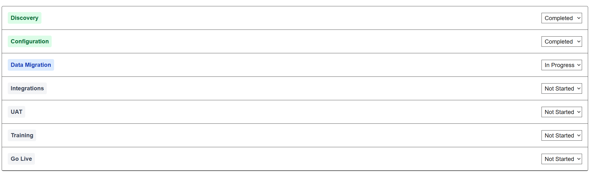

# 🚀 LaunchTrack — SaaS Implementation Intelligence Platform

LaunchTrack is a multi-tenant SaaS system designed to help implementation teams manage high-volume customer onboarding and detect delivery risks early.

## 🧩 System Architecture

LaunchTrack is part of a multi-component system:

* **Notify Engine** → Event-driven notification system (Slack, Email, Webhooks)
* **LaunchTrack Dashboard** → Analytics dashboard for project health and delivery insights

## 🔗 Related Projects

* Notify Engine: https://github.com/psysush10/notify-engine
* Dashboard: https://github.com/psysush10/launchtrack-dashboard

## 🎯 Problem

Implementation teams in B2B SaaS often handle 40–60+ onboarding projects simultaneously using CRMs, spreadsheets, and project tools.

This leads to:

* Fragmented visibility across projects
* Delayed identification of risks
* Reactive instead of proactive delivery management

## 💡 Solution

LaunchTrack provides a centralized system focused on **implementation visibility and early risk detection**, helping teams answer:

👉 *“Which implementations are likely to slip before they actually do?”*

---

## ⚡ Key Capabilities

* 🧭 **Portfolio Dashboard**
  View all ongoing implementations with status, progress, and timelines

* 🚨 **Command Center (Core Feature)**
  Identify at-risk projects based on signals like:

  * Open risks
  * Upcoming go-live dates
  * Delayed milestones

* 📊 **Project Tracking**
  Structured visibility into milestones, timelines, and progress

* ⚠️ **Risk Management System**
  Capture real-world blockers such as:

  * Client delays
  * Integration dependencies
  * Readiness issues

---

## 📸 Screenshots

### Dashboard



### Command Center (Risk Detection)



### Project Tracking





---

## 🏗 Architecture & Engineering Highlights

* Multi-tenant SaaS architecture (organizations + role-based access)
* Secure data isolation using Supabase Row-Level Security (RLS)
* Backend powered by PostgreSQL (via Supabase)
* Built with Next.js App Router

---

## 🛠 Tech Stack

**Frontend**

* Next.js (App Router)
* React
* TailwindCSS

**Backend**

* Supabase (Auth + Database)
* PostgreSQL

---

## 🔄 Data Model

```
projects
 ├── milestones
 └── risks
```

---

## 🚀 Live Demo

https://launch-track-mu.vercel.app/

---

## 🎥 Demo Video

(Add Loom link here — coming next step)

---

## 📦 Setup Instructions

```bash
git clone <repo>
cd launch-track
npm install
npm run dev
```

Create `.env.local`:

```
NEXT_PUBLIC_SUPABASE_URL=
NEXT_PUBLIC_SUPABASE_ANON_KEY=
```

---

## 🔮 Future Improvements

* Predictive risk scoring
* Workflow automation
* Slack / email alerts
* CRM integrations
* Advanced analytics dashboard

---

## 🧠 Key Insight

Most tools focus on execution.
LaunchTrack focuses on **delivery intelligence** — enabling proactive decision-making across implementation portfolios.
